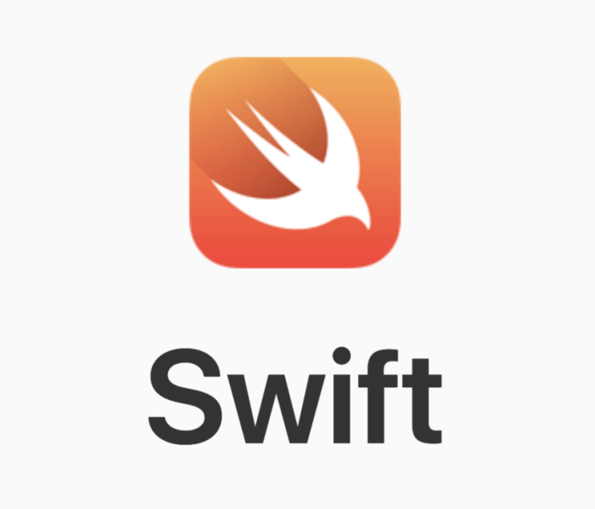
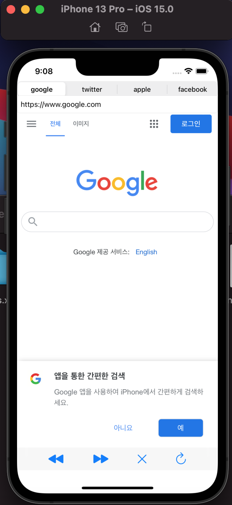
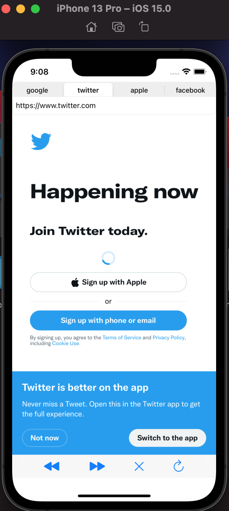
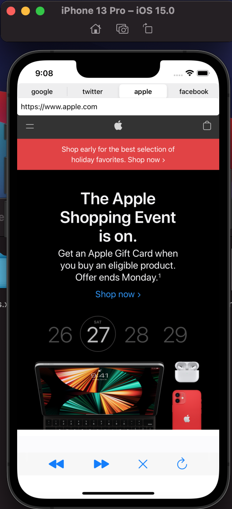
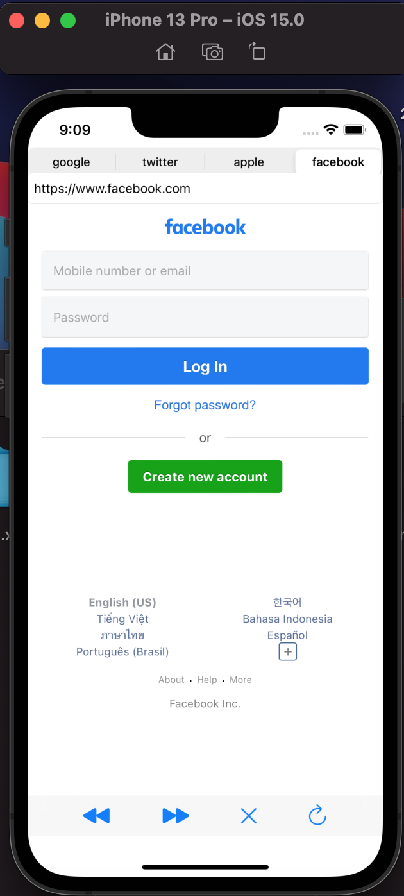

# Web Browser - Swift application

## Introduction for Swift

In the field of os application, Swift is a representative languege for developing applications with many benefits.. 

Here are the reasons **[why we use the swift]**

Figure 1 - Swift official logo

1. Swift is an open source.
The use and development of Swift accelerated after Apple made it an open source. According to the monthly TIOBE index in March 2017, Swift has become the world's top 10 most popular programming languages. PYPL programming language popularity is also one of the top 10 languages evaluated in tracking.

2. Swift is fast.
It is argued that the code created using Swift is as fast as the compiled C code. This language was developed in a way that eliminates tedious tasks (e.g., semicolon input when changing rows) for a development environment with improved responsiveness. According to Apple's claim, the speed of completing the search algorithm is up to 2.6 times faster than Objective-C and up to 8.4 times faster than Python 2.7.
Apple introduces Swift as "a fast and efficient language that provides real-time feedback and can be fully integrated into object-C codes."

3. Swift is safe.
The Swift team is paying a lot of attention to security. Therefore, there is no unsafe code when working in this language, and the latest programming rules that keep the app tightly safe are used.

## Web Browser

When I didn't know anything about app development, it was the development of this "web browser" that I tried recklessly. I wondered how browsers such as Chrome and Explorer work and run.

Although it was a simple web browser, it was my first app work, and it was a fascinating and fun experience to be able to do all the functions of the browser than I thought.

Figure 2 - Implement code with simulator - google

Figure 3 - Implement code with simulator - twitter

Figure 4 - Implement code with simulator - apple

Figure 5 - Implement code with simulator - facebook

# Future Work

I'm not yet 18 years old (as of November 2021), so I haven't registered as an Apple app developer, but I'll supplement my web browser and upload it to the App Store. I want to focus on stability and practicality and create a web browser such as Chrome.
Other apps using Swift will also be created and uploaded to the App Store.

# My Work Code 

https://github.com/SeoHyeonBeom/Sources.git

# References

https://www.itworld.co.kr/news/106157
