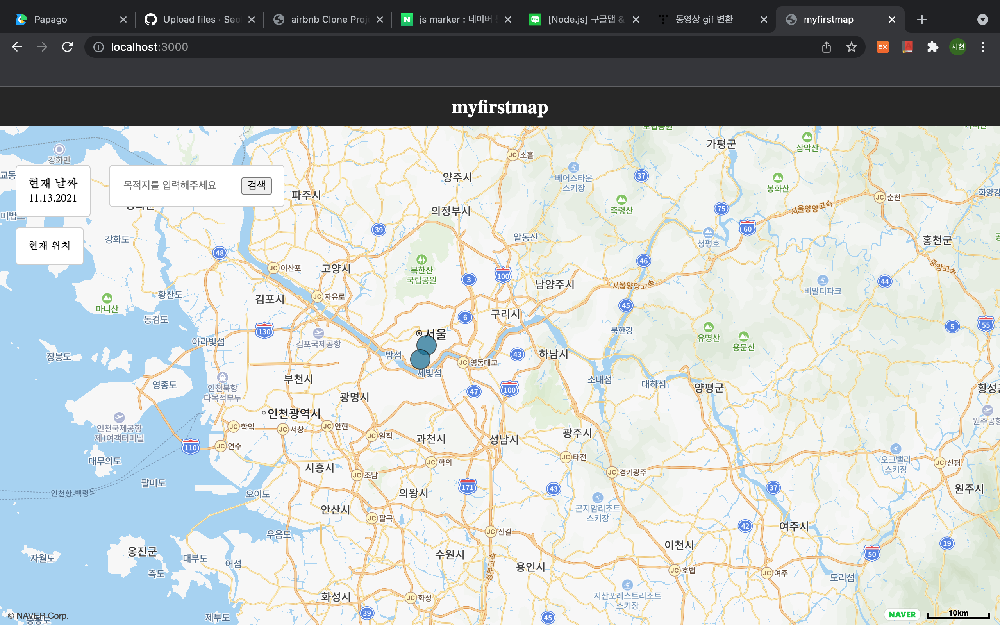
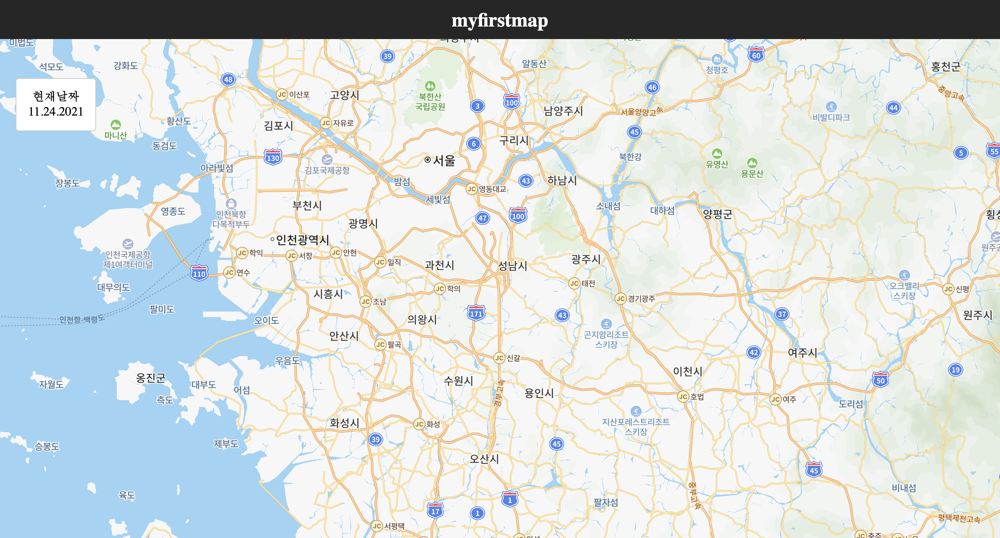
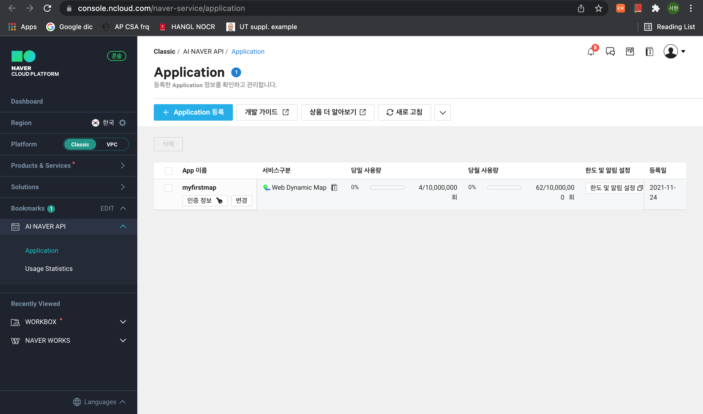
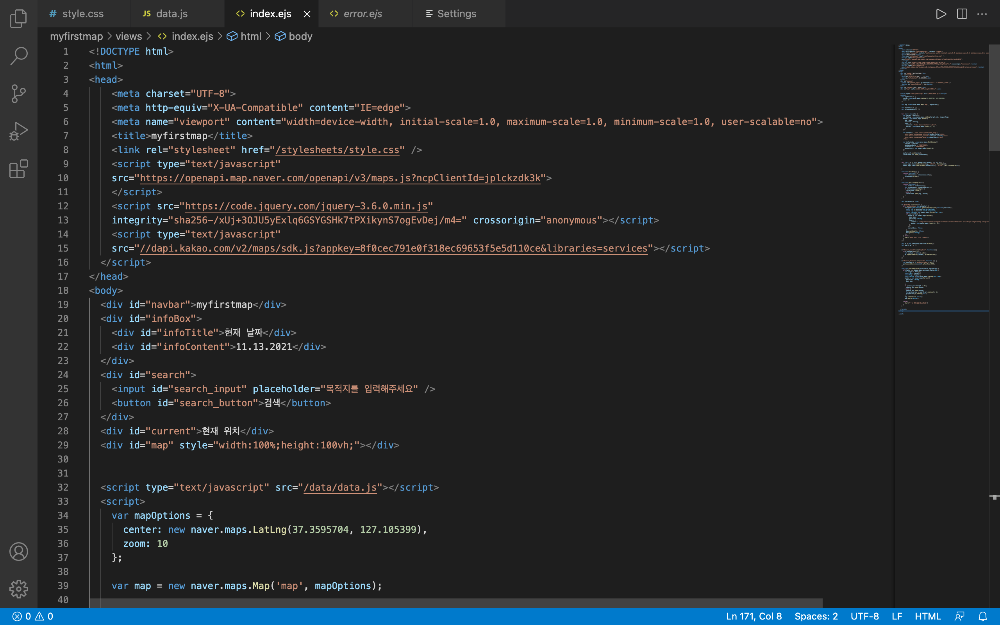
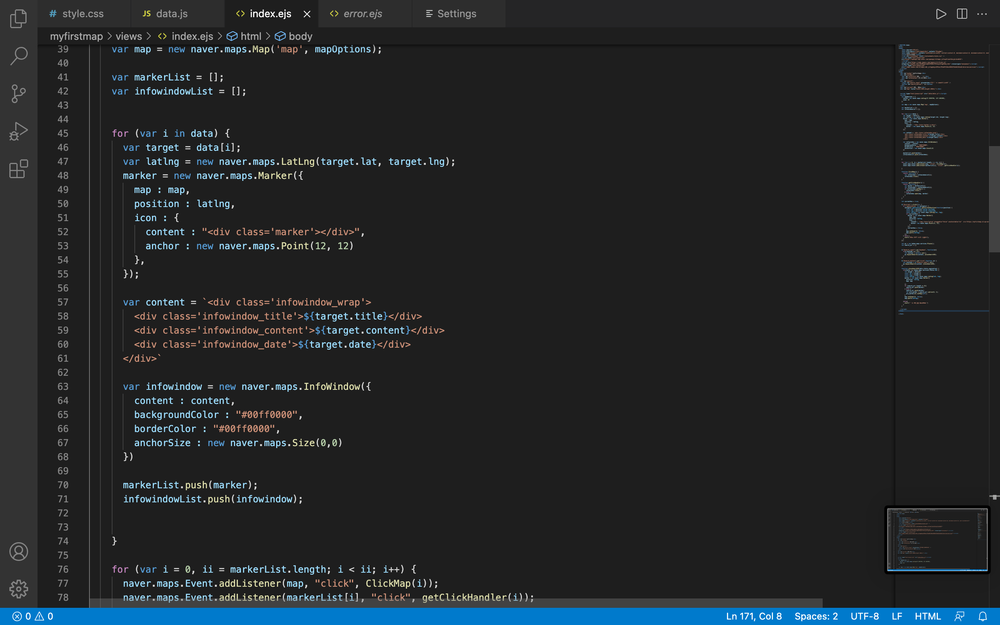
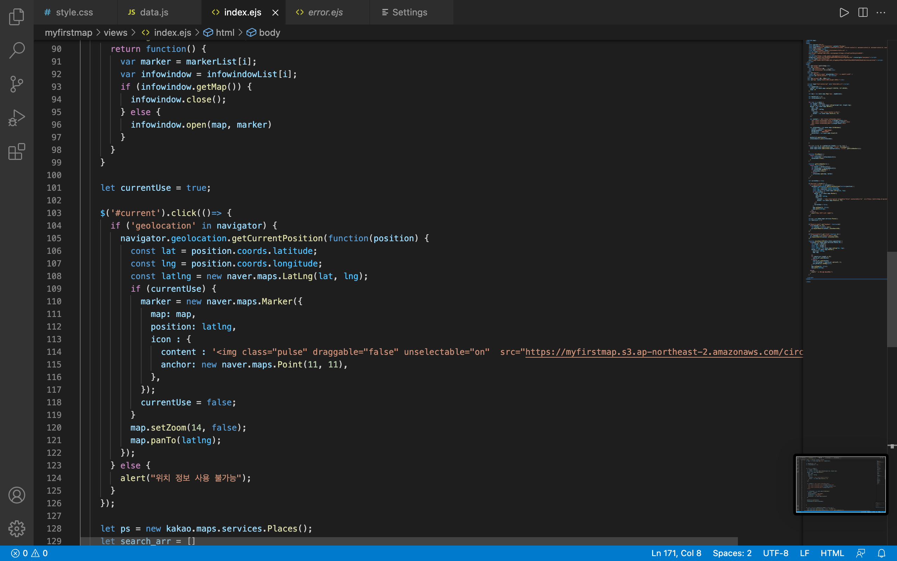
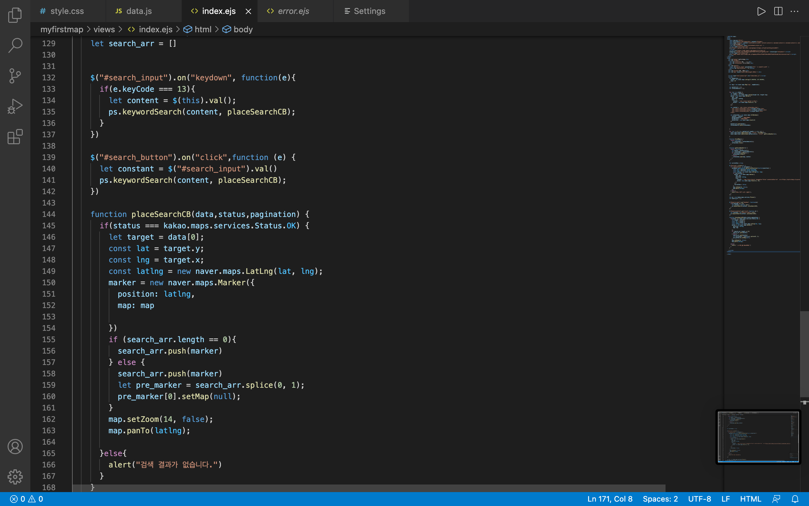

# Map Service - Using Naver API

## Introduction for My First Map

Map service is a project that can quickly, easily and accurately understand web development.

Figure 1 - My map page

**What can we learn and gain from this project?**

1. Establishing a basic initial environment to develop the web.

Figure 2 - My map page

2. Establishing a web-based map service through Naver Map api.

Figure 3 - Naver API 

3. Creating markers, info windows, and infoboxes required for fundamental map services.

Figure 4 - markers, info windows, infoboxes

4. Knowledge related to html, css, and js needed for web development.

Figure 5 - my code

5. Implementation of destination search function through Kakao api.

Figure 1 - My map page

## During working this project..

I had fun developing apps, but in fact, I was not interested in web development and was not interested. However, after the coronavirus broke out, map services began to emerge rapidly, and I started to know how this service was implemented. Through the map service, I naturally learned what web development is. It wasn't easy to watch, study, and practice lectures alone, but I'm proud to see the results.

Although it is a simple map service, it is my first web, and it is a fascinating and fun experience to be able to do all the functions of the webs than I thought.

# Future Work

The Covid-19 Map service has the function of updating corona confirmed patients in real time, and it takes too much time and money to reproduce there. I first knew that I had to manually update the number of confirmed cases every time, and that the more users I had, the more funds I needed to maintain web services. In the future, I will create a wonderful web page on time to receive investment from many companies and create a web page that can have a beneficial impact on people.

# My Work Code 

https://github.com/SeoHyeonBeom/Sources.git

# References

https://navermaps.github.io/maps.js.ncp/

https://www.ncloud.com/

